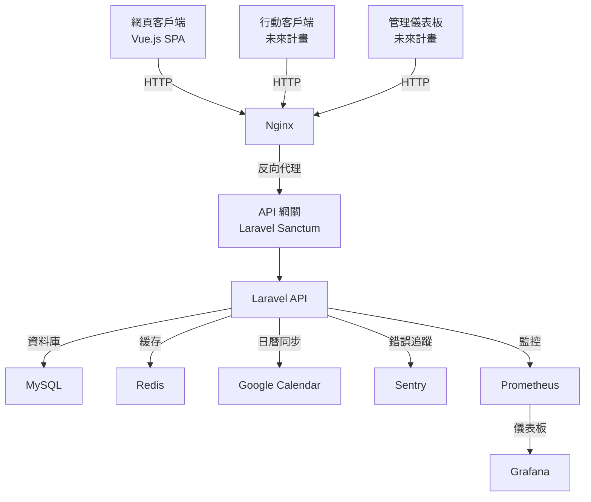

# 健身房管理系統

## 專案概述

健身房管理系統是一個功能完整的健身房管理解決方案，結合 Laravel 後端 API 和 Vue.js 單頁應用（SPA）。本專案提供核心程式碼，包含模組化的會員管理（等級與積分）、教練管理（資料與薪資計算）、課程管理（排程、預約與候補名單），並整合外部服務如 Google Calendar、Sentry 錯誤追蹤和 Prometheus/Grafana 監控。使用者需將核心程式碼整合至全新安裝的 Laravel 框架中。

本專案展示以下技術亮點：
- **模組化架構**：採用 `app/Modules` 結構，將業務邏輯分為 Membership、Trainer、Course 三個模組，提升程式碼可維護性。
- **高效 API**：使用 Laravel Sanctum 提供安全認證，搭配 Redis 隊列與緩存，支援高併發請求。
- **現代化前端**：Vue.js 3 搭配 FullCalendar 和 Tailwind CSS，提供響應式課程日曆介面。
- **監控與錯誤追蹤**：整合 Prometheus/Grafana 監控 API 效能，Sentry 捕捉運行時錯誤。
- **容器化部署**：使用 Docker 實現一致的開發與生產環境。

> **GitHub 倉庫**：https://github.com/BpsEason/gym-system.git

## 系統架構

以下是系統架構的 Mermaid 流程圖，展示主要組件和資料流：



## 技術棧

- **後端**：
  - Laravel 11.x
  - PHP 8.2
  - MySQL（資料庫）
  - Redis（緩存與隊列）
  - Laravel Sanctum（API 認證）
  - Sentry（錯誤追蹤）
  - Prometheus（監控）
  - Scribe（API 文件生成）
  - Pest 與 PHPUnit（測試框架）

- **前端**：
  - Vue.js 3
  - Vue Router
  - Vite（構建工具）
  - Tailwind CSS（樣式）
  - FullCalendar（課程日曆）

- **DevOps**：
  - Docker（Nginx、PHP、MySQL、Redis、Prometheus、Grafana）
  - GitHub Actions（CI/CD，位於 `.github/workflows`）

## 技術亮點

1. **模組化架構**：
   - 使用 `app/Modules` 目錄結構，包含 Membership、Trainer、Course 三個模組，每個模組有獨立的控制器、模型、儲存庫和服務。
   - 透過 `ServiceProvider` 自動載入模組路由和配置，提升可擴展性。

2. **高併發處理**：
   - 使用 Redis 隊列（`config/queue.php`）處理薪資計算（`Trainer\Jobs\CalculateMonthlySalary`）和等級到期提醒（`Membership\Jobs\SendTierExpirationReminder`）。
   - API 端點（如 `/api/course/{scheduleId}/book`）採用異步處理，確保高併發穩定性。

3. **前端體驗**：
   - `CourseCalendar.vue` 使用 FullCalendar 動態渲染課程排程，支援日期範圍篩選。
   - Tailwind CSS 實現響應式設計，適配多種設備。

4. **外部服務整合**：
   - Google Calendar 同步課程排程（`Course\Services\GoogleCalendarService`）。
   - Sentry 捕捉 API 錯誤（`app/Exceptions/Handler.php`）。
   - Prometheus 監控 API 效能（`/api/metrics`），搭配 Grafana 視覺化。

5. **測試覆蓋**：
   - 每個模組包含單元測試（`tests/Unit`）和功能測試（`tests/Feature`），使用 Pest 和 PHPUnit。

## 關鍵代碼展示

以下是核心模組的代表性程式碼片段，包含詳細註解，展示功能實現與設計決策。

### 1. 會員等級升降邏輯（`app/Modules/Membership/Services/TierUpgradeService.php`）

```php
<?php

namespace App\Modules\Membership\Services;

use App\Modules\Membership\Models\Member;
use Illuminate\Support\Facades\Log;

class TierUpgradeService
{
    /**
     * 檢查會員積分並升降等級
     * @param Member $member 會員模型實例
     * @return void
     */
    public function checkAndUpgradeTier(Member $member): void
    {
        $points = $member->points; // 獲取會員當前積分
        $currentTier = $member->tier; // 獲取會員當前等級
        $newTier = $this->determineTier($points); // 根據積分計算新等級

        // 若新等級與當前等級不同，則更新會員等級並記錄日誌
        if ($newTier !== $currentTier) {
            $member->update(['tier' => $newTier]);
            Log::info("Member {$member->id} tier upgraded from {$currentTier} to {$newTier}");
        }
    }

    /**
     * 根據積分確定會員等級
     * @param int $points 會員積分
     * @return string 新等級名稱
     */
    private function determineTier(int $points): string
    {
        $tiers = config('points.tiers'); // 從配置檔案獲取等級閾值
        foreach ($tiers as $tier => $threshold) {
            if ($points >= $threshold) {
                return $tier; // 返回符合條件的最高等級
            }
        }
        return 'Bronze'; // 默認最低等級
    }
}
```

**設計說明**：
- **配置驅動**：使用 `config/points.php` 定義等級閾值，方便動態調整。
- **日誌記錄**：透過 `Log::info` 記錄等級變化，利於追蹤和除錯。
- **依賴注入**：注入 `Member` 模型，提升可測試性並遵循 SOLID 原則。

### 2. 課程預約處理（`app/Modules/Course/Http/Controllers/CourseBookingController.php`）

```php
<?php

namespace App\Modules\Course\Http\Controllers;

use App\Modules\Course\Models\CourseSchedule;
use App\Modules\Course\Services\BookingService;
use Illuminate\Http\JsonResponse;
use Illuminate\Support\Facades\Auth;

class CourseBookingController extends Controller
{
    protected $bookingService;

    /**
     * 建構函數，注入預約服務
     * @param BookingService $bookingService 課程預約服務
     */
    public function __construct(BookingService $bookingService)
    {
        $this->bookingService = $bookingService;
    }

    /**
     * 處理課程預約請求
     * @param CourseSchedule $schedule 課程排程模型
     * @return JsonResponse 預約結果
     */
    public function book(CourseSchedule $schedule): JsonResponse
    {
        // 檢查課程是否已滿
        if ($schedule->isFull()) {
            return response()->json(['message' => 'Course is full'], 400);
        }

        $user = Auth::user(); // 獲取當前認證用戶
        $result = $this->bookingService->book($user, $schedule); // 執行預約邏輯

        // 返回標準化的 JSON 響應
        return response()->json([
            'message' => $result ? 'Booking successful' : 'Booking failed',
            'data' => $result ? $schedule : null
        ], $result ? 200 : 400);
    }
}
```

**設計說明**：
- **服務層分離**：使用 `BookingService` 封裝預約邏輯，降低控制器複雜度，符合單一職責原則。
- **高併發處理**：透過 `isFull` 方法和 Redis 鎖（在 `BookingService` 中實現）防止超賣。
- **RESTful 規範**：返回標準化的 JSON 響應，包含狀態碼和訊息，易於前端處理。

### 3. 前端課程日曆（`resources/js/pages/CourseCalendar.vue`）

```vue
<template>
  <div>
    <FullCalendar :options="calendarOptions" />
  </div>
</template>

<script>
import FullCalendar from '@fullcalendar/vue3';
import dayGridPlugin from '@fullcalendar/daygrid';
import timeGridPlugin from '@fullcalendar/timegrid';
import { ref } from 'vue';
import axios from 'axios';

export default {
  components: { FullCalendar },
  setup() {
    // 定義日曆配置，包含插件和事件數據
    const calendarOptions = ref({
      plugins: [dayGridPlugin, timeGridPlugin], // 月視圖和時間視圖插件
      initialView: 'dayGridMonth', // 默認顯示月視圖
      events: async (fetchInfo, successCallback) => {
        // 透過 API 獲取課程排程數據
        const response = await axios.get('/api/course/schedules', {
          params: {
            start: fetchInfo.startStr, // 開始日期
            end: fetchInfo.endStr // 結束日期
          }
        });
        successCallback(response.data); // 將數據傳遞給 FullCalendar
      }
    });

    return { calendarOptions };
  }
};
</script>
```

**設計說明**：
- **動態數據載入**：使用 `axios` 從 `/api/course/schedules` 獲取課程排程，支援日期範圍篩選。
- **響應式設計**：搭配 Tailwind CSS（在 `resources/css/app.css` 中配置），確保日曆在多設備上顯示一致。
- **模組化組件**：採用 Vue 3 的 Composition API，提升程式碼可讀性和可維護性。

## 環境要求

- PHP >= 8.2
- Composer
- Node.js >= 18.x
- npm >= 9.x
- Docker 和 Docker Compose
- MySQL 8.0 或更高版本
- Redis 7.0 或更高版本
- Git

## 安裝步驟

本專案僅包含核心程式碼（`app/Modules`、`resources/js`、`.docker` 等），需整合至全新安裝的 Laravel 框架。請按照以下步驟設置：

1. **安裝 Laravel 框架**：
   創建一個新的 Laravel 專案：
   ```bash
   composer create-project laravel/laravel gym-system 11.*
   cd gym-system
   ```

2. **克隆核心程式碼**：
   將本倉庫的核心程式碼克隆到本地，並複製到 Laravel 專案：
   ```bash
   git clone https://github.com/BpsEason/gym-system.git gym-system-core
   cp -r gym-system-core/app/Modules app/
   cp -r gym-system-core/resources/js resources/
   cp -r gym-system-core/resources/views resources/
   cp -r gym-system-core/.docker .
   cp -r gym-system-core/config/points.php config/
   cp -r gym-system-core/config/salary.php config/
   cp -r gym-system-core/tests app/Modules/
   cp gym-system-core/.env.example .env
   cp -r gym-system-core/routes/api.php routes/
   cp -r gym-system-core/config/scribe.php config/
   cp -r gym-system-core/config/sanctum.php config/
   ```

3. **設置環境檔案**：
   生成應用程式密鑰並編輯 `.env`：
   ```bash
   php artisan key:generate
   ```
   確保 `.env` 包含資料庫和外部服務配置，例如：
   ```env
   DB_CONNECTION=mysql
   DB_HOST=mysql
   DB_PORT=3306
   DB_DATABASE=gym_system
   DB_USERNAME=gymuser
   DB_PASSWORD=gympassword
   REDIS_HOST=redis
   SENTRY_LARAVEL_DSN=
   GOOGLE_CALENDAR_CREDENTIALS_PATH=storage/app/google-credentials.json
   GOOGLE_CALENDAR_TOKEN_PATH=storage/app/google-token.json
   ```

4. **更新 Composer 依賴**：
   編輯 `composer.json`，添加以下依賴：
   ```json
   {
       "require": {
           "laravel/sanctum": "^3.2",
           "knuckleswtf/scribe": "^4.0",
           "sentry/sentry-laravel": "^3.0",
           "spatie/laravel-google-calendar": "^3.0"
       },
       "autoload": {
           "psr-4": {
               "App\\Modules\\": "app/Modules/"
           }
       }
   }
   ```
   運行：
   ```bash
   composer update
   ```

5. **設置 Docker 環境**：
   使用以下 `docker-compose.yml` 範例：
   ```yaml
   version: '3.8'
   services:
     laravel.test:
       build:
         context: ./.docker/php
       ports:
         - "8000:8000"
       volumes:
         - .:/var/www/html
       depends_on:
         - mysql
         - redis
     mysql:
       image: mysql:8.0
       environment:
         MYSQL_DATABASE: gym_system
         MYSQL_USER: gymuser
         MYSQL_PASSWORD: gympassword
         MYSQL_ROOT_PASSWORD: rootpassword
       ports:
         - "3306:3306"
     redis:
       image: redis:7.0
       ports:
         - "6379:6379"
     nginx:
       image: nginx:latest
       ports:
         - "80:80"
       volumes:
         - ./.docker/nginx:/etc/nginx/conf.d
         - .:/var/www/html
       depends_on:
         - laravel.test
     prometheus:
       image: prom/prometheus:latest
       ports:
         - "9090:9090"
     grafana:
       image: grafana/grafana:latest
       ports:
         - "3000:3000"
   ```
   保存為 `docker-compose.yml`，運行：
   ```bash
   docker compose up -d
   ```

6. **執行資料庫遷移和填充**：
   ```bash
   docker compose exec laravel.test php artisan migrate --seed
   ```

7. **安裝前端依賴**：
   編輯 `package.json`，確保包含以下依賴：
   ```json
   {
       "dependencies": {
           "vue": "^3.2",
           "vue-router": "^4.0",
           "axios": "^1.0",
           "@fullcalendar/vue3": "^6.0",
           "@fullcalendar/daygrid": "^6.0",
           "@fullcalendar/timegrid": "^6.0",
           "tailwindcss": "^3.0",
           "vite": "^4.0"
       }
   }
   ```
   運行：
   ```bash
   npm install
   npm run dev
   ```
   生產環境構建：
   ```bash
   npm run build
   ```

8. **生成 API 文件**：
   ```bash
   docker compose exec laravel.test php artisan scribe:generate
   ```

9. **訪問應用程式**：
   - 後端 API：`http://localhost:8000`
   - API 文件：`http://localhost/docs`
   - 前端 SPA：`http://localhost`
   - Prometheus 監控：`http://localhost:9090`
   - Grafana 儀表板：`http://localhost:3000`（預設帳號/密碼：admin/admin）

## API 文件

使用 Scribe 生成 API 文件，位於 `docs/api/`，可在 `http://localhost/docs` 查看：
```bash
docker compose exec laravel.test php artisan scribe:generate
```

主要 API 端點：
- **認證**：`POST /api/register`, `POST /api/login`, `POST /api/logout`
- **會員**：`/api/membership/*`（如 `/api/membership/my-membership`）
- **教練**：`/api/trainer/*`（如 `/api/trainer`, `/api/trainer/{id}/salary`）
- **課程**：`/api/course/*`（如 `/api/course`, `/api/course/schedules`）

## 外部服務配置

- **Sentry 錯誤追蹤**：
  - 設置 `.env` 中的 `SENTRY_LARAVEL_DSN`（從 Sentry 儀表板獲取）。
  - 錯誤自動記錄至 Sentry（見 `app/Exceptions/Handler.php`）。

- **Google Calendar 整合**：
  - 將認證檔案放置於 `storage/app/google-credentials.json`。
  - 在 `.env` 中設置：
    ```env
    GOOGLE_CALENDAR_CREDENTIALS_PATH=storage/app/google-credentials.json
    GOOGLE_CALENDAR_TOKEN_PATH=storage/app/google-token.json
    ```

- **Prometheus 和 Grafana**：
  - Prometheus 監控端點：`/api/metrics`
  - Grafana 儀表板：`http://localhost:3000`

## 測試

專案包含單元測試（`tests/Unit`）和功能測試（`tests/Feature`），位於 `app/Modules/*/Tests`：
```bash
docker compose exec laravel.test php artisan test
```

## 貢獻

1. Fork 本專案。
2. 創建功能分支（`git checkout -b feature/YourFeature`）。
3. 提交更改（`git commit -m 'Add YourFeature'`）。
4. 推送到分支（`git push origin feature/YourFeature`）。
5. 提交 Pull Request。

## 授權

本專案採用 MIT 授權。詳見 `LICENSE` 文件。

## 聯繫方式

如有問題，請聯繫 [bps.eason@example.com] 或在 GitHub 提交 Issue。
