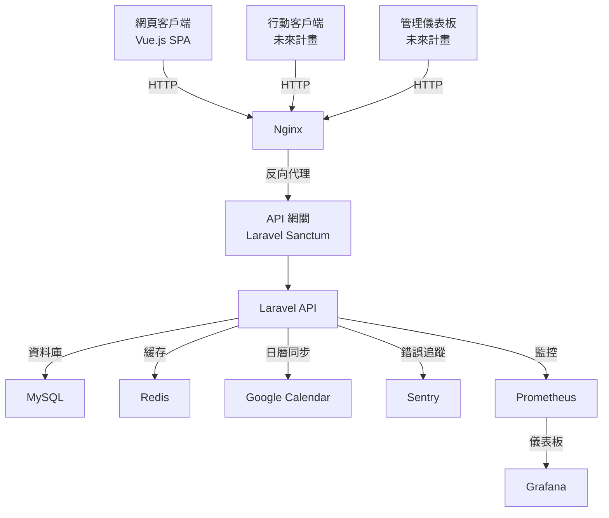

# 健身房管理系統

## 專案概述

健身房管理系統是一個結合 Laravel 後端 API 和 Vue.js 單頁應用（SPA）的解決方案，旨在提供高效的健身房管理功能。本專案僅包含核心程式碼（模組化業務邏輯和前端資源），需整合至全新安裝的 Laravel 框架。系統支援會員管理（等級與積分）、教練管理（資料與薪資計算）、課程管理（排程、預約與候補名單），並整合 Google Calendar、Sentry 錯誤追蹤和 Prometheus/Grafana 監控。

以下以問答形式詳細介紹專案的技術實現、設計決策和未來擴展計劃，面向開發者展示技術亮點。

## 系統架構

以下是系統架構的 Mermaid 流程圖，展示主要組件和資料流：



## 一、專案概覽與架構理解

### 1.1 專案介紹與核心功能

**Q：這個健身房管理系統是做什麼的？它解決了哪些問題？**

A：本系統為健身房提供全面的管理解決方案，包含會員等級與積分管理、教練資料與薪資計算、課程排程與預約管理。解決的問題包括：
- **會員管理**：自動化等級升降和積分計算，激勵會員參與課程。
- **教練管理**：簡化薪資計算（固定薪資 + 課程費用），提升財務效率。
- **課程管理**：支援線上預約、候補名單和 Google Calendar 同步，提升用戶體驗。
- **運營監控**：整合 Sentry 和 Prometheus/Grafana，確保系統穩定性和效能。

**Q：專案最核心的業務邏輯是什麼？**

A：核心業務邏輯是課程預約與管理（`Course` 模組），包括：
- 課程排程的動態生成與展示（`CourseSchedule`）。
- 預約邏輯，支援容量檢查和候補名單（`CourseBooking` 和 `Waitlist`）。
- 與 Google Calendar 同步，確保教練和會員的日程一致性。

這部分邏輯直接影響用戶體驗和運營效率，是系統的關鍵。

**Q：若時間有限，你會展示哪個功能來突顯專案亮點？**

A：我會展示課程預約功能（`/api/course/{scheduleId}/book` 和 `CourseCalendar.vue`），因為它：
- 結合後端高併發處理（Redis 鎖）和前端動態展示（FullCalendar）。
- 展示模組化設計（`Course\Services\BookingService`）和外部整合（Google Calendar）。
- 直接影響用戶體驗，體現系統的核心價值。

### 1.2 系統架構理解

**Q：為什麼採用模組化架構（`app/Modules`）？好處和挑戰是什麼？**

A：模組化架構將業務邏輯分為 `Membership`、`Trainer`、`Course` 三個模組，每個模組包含獨立的控制器、模型、服務等。
- **好處**：
  - **高內聚低耦合**：各模組獨立，減少程式碼糾結，易於維護和擴展。
  - **可測試性**：模組化便於為每個模組撰寫單元測試（`app/Modules/*/Tests`）。
  - **團隊協作**：不同開發者可獨立開發模組，降低衝突。
- **挑戰**：
  - **初始設置複雜**：需配置 `ServiceProvider` 和 PSR-4 自動載入（`composer.json`）。
  - **模組間依賴**：需謹慎管理共用邏輯（如 `Membership` 與 `Course` 的會員預約關聯）。

**Q：為什麼選擇 Laravel 11.x 和 Vue.js 3？**

A：
- **Laravel 11.x**：
  - 提供強大的 ORM（Eloquent）、路由系統和中介軟體，適合快速開發 RESTful API。
  - 支援 Sanctum 認證，與 SPA 應用無縫整合。
  - 活躍的生態系統和長期支援（LTS），確保穩定性。
- **Vue.js 3**：
  - Composition API 提供靈活的組件化開發，適合複雜前端邏輯。
  - 高效的響應式系統和輕量級特性，提升前端性能。
  - 與 Vite 和 Tailwind CSS 整合，加速開發和響應式設計。

**Q：為什麼使用 Docker Compose 部署多個服務？Docker 的角色是什麼？**

A：
- **為什麼用 Docker Compose**：
  - 簡化多服務管理（Nginx、PHP、MySQL、Redis、Prometheus、Grafana），透過單一 `docker-compose.yml` 定義依賴和配置。
  - 確保環境一致性，消除「在我的機器上可以運行」的問題。
  - 支援快速部署和擴展，適合開發、測試和生產環境。
- **Docker 的角色**：
  - 容器化各服務，隔離運行環境，減少依賴衝突。
  - 提供可重現的部署流程，透過 `.docker/php` 和 `.docker/nginx` 配置文件實現客製化。
  - 支援 CI/CD 流水線（如 GitHub Actions），自動化構建和測試。

**Q：Laravel Sanctum 如何解決認證問題？為什麼適合 SPA？**

A：
- **解決的認證問題**：
  - 提供基於 token 的 API 認證，支援無狀態（stateless）和有狀態（stateful）認證。
  - 處理 CSRF 保護，確保 SPA 跨域請求安全。
  - 支援簡單的 token 管理（發行、撤銷），無需複雜的 OAuth 流程。
- **為什麼適合 SPA**：
  - 與 Laravel 無縫整合，透過 `SANCTUM_STATEFUL_DOMAINS` 支援跨域請求。
  - 提供簡單的認證流程（`POST /api/login` 返回 token），適合前端（如 Vue.js）使用。
  - 支援 session-based 認證，適配 SPA 和傳統網頁混合應用。

## 二、後端技術深度 (Laravel / PHP)

### 2.1 模組化設計

**Q：Membership、Trainer、Course 模組如何劃分？它們之間的依賴關係是什麼？**

A：
- **劃分方式**：
  - **Membership**：管理會員等級（`MemberTier`）、積分（`PointService`）、等級升降（`TierUpgradeService`）。
  - **Trainer**：管理教練資料（`Trainer`）、薪資計算（`CalculateMonthlySalary`）。
  - **Course**：管理課程（`Course`）、排程（`CourseSchedule`）、預約（`CourseBooking`）和候補（`Waitlist`）。
- **依賴關係**：
  - `Course` 依賴 `Membership`（預約需檢查會員資格）和 `Trainer`（排程需關聯教練）。
  - `Membership` 和 `Trainer` 相對獨立，但透過 `User` 模型間接關聯（會員和教練均為用戶）。
  - 使用儲存庫模式（`Repositories`）和服務層（`Services`）解耦依賴，確保模組間通訊清晰。

**Q：ServiceProvider 在 Laravel 啟動中的角色？如何載入模組？**

A：
- **角色**：
  - `MembershipServiceProvider` 等模組的 `ServiceProvider` 負責註冊模組的路由（`routes/api.php`）、配置（`config/points.php`）和依賴（服務、儲存庫）。
  - 在 Laravel 啟動時，透過 `config/app.php` 的 `providers` 陣列自動載入。
- **載入方式**：
  - 在 `composer.json` 中配置 PSR-4 自動載入：
    ```json
    "autoload": {
        "psr-4": {
            "App\\Modules\\": "app/Modules/"
        }
    }
    ```
  - 每個模組的 `ServiceProvider` 使用 `boot` 方法載入模組路由：
    ```php
    public function boot()
    {
        $this->loadRoutesFrom(base_path('app/Modules/Membership/routes/api.php'));
    }
    ```
  - 使用 `composer dump-autoload` 確保模組命名空間正確載入。

**Q：如何處理模組間的程式碼複用和共用邏輯？**

A：
- **共用邏輯**：
  - 定義抽象基類（如 `app/Modules/BaseRepository`）供模組儲存庫繼承，實現共用的 CRUD 操作。
  - 使用服務層（`Services`）封裝業務邏輯，例如 `PointService` 可被 `Membership` 和 `Course` 共用。
- **程式碼複用**：
  - 透過 trait 實現共用功能，例如認證檢查或日誌記錄。
  - 使用 Laravel 的配置檔案（`config/points.php`）集中管理共用參數。
  - 透過事件和監聽器（如 `Membership\Events\TierUpgraded`）實現模組間鬆耦合通訊。

### 2.2 資料庫與 ORM

**Q：資料表之間的關聯關係是什麼？**

A：
- **users**：儲存用戶資料（會員和教練的基礎表）。
- **member_tiers**：儲存會員等級（一對一，`Member` 繼承 `User`，`member_tiers.user_id` 關聯 `users.id`）。
- **trainers**：儲存教練資料（一對一，`trainers.user_id` 關聯 `users.id`）。
- **courses**：儲存課程資料（獨立表）。
- **course_schedules**：儲存課程排程（多對一，`course_schedules.course_id` 關聯 `courses.id`，`course_schedules.trainer_id` 關聯 `trainers.id`）。
- **course_bookings**：儲存預約記錄（多對一，`course_bookings.schedule_id` 關聯 `course_schedules.id`，`course_bookings.user_id` 關聯 `users.id`）。
- **waitlists**：儲存候補名單（多對一，`waitlists.schedule_id` 關聯 `course_schedules.id`，`waitlists.user_id` 關聯 `users.id`）。

**Q：`onDelete('cascade')` 和 `onDelete('restrict')` 的區別？為什麼這樣選擇？**

A：
- **區別**：
  - `onDelete('cascade')`：當父表記錄刪除時，子表相關記錄自動刪除。例如，`course_schedules.course_id` 使用 `cascade`，刪除課程時自動刪除其排程。
  - `onDelete('restrict')`：禁止刪除父表記錄，除非子表相關記錄已清空。例如，`course_bookings.schedule_id` 使用 `restrict`，防止刪除仍有預約的排程。
- **選擇原因**：
  - 使用 `cascade` 於層級關係明確的情況（如課程與排程），簡化數據清理。
  - 使用 `restrict` 於業務敏感數據（如預約記錄），防止意外刪除，確保數據完整性。

**Q：`Member` 模型繼承 `User` 模型的好處和壞處？**

A：
- **好處**：
  - **程式碼復用**：`Member` 繼承 `User` 的認證屬性（如 `email`、`password`），減少重複定義。
  - **簡化關聯**：`Member` 可直接使用 `User` 的認證功能（如 Sanctum token）。
  - **邏輯分離**：將會員特定屬性（如 `points`、`tier`）封裝在 `Member` 中，保持清晰。
- **壞處**：
  - **耦合性**：`Member` 依賴 `User` 的表結構，修改 `users` 表可能影響 `Member`。
  - **複雜性**：繼承可能增加模型關係的維護成本，特別是在多模組環境中。

### 2.3 API 開發與認證

**Q：`routes/api.php` 中路由加載方式的優缺點？如何自動化模組路由？**

A：
- **加載方式**：
  ```php
  Route::prefix('membership')->group(base_path('app/Modules/Membership/routes/api.php'));
  ```
- **優點**：
  - 明確指定模組路由檔案，易於管理和除錯。
  - 支援前綴（如 `membership`），保持 URL 結構清晰。
- **缺點**：
  - 手動引入每個模組路由，新增模組需修改 `routes/api.php`，不夠自動化。
  - 若模組數量多，路由檔案管理可能變複雜。
- **自動化方案**：
  - 在 `ServiceProvider` 中動態掃描模組目錄：
    ```php
    public function boot()
    {
        $modules = glob(base_path('app/Modules/*/routes/api.php'));
        foreach ($modules as $file) {
            $module = basename(dirname(dirname($file)));
            Route::prefix(strtolower($module))->group($file);
        }
    }
    ```
  - 確保模組路由檔案遵循命名規範（如 `api.php`），實現自動載入。

**Q：Sanctum 的認證流程？跨域如何工作？**

A：
- **認證流程**：
  1. 用戶透過 `POST /api/login` 提交憑證，獲取 token。
  2. 前端將 token 儲存（localStorage 或 cookie），並在後續請求的 `Authorization: Bearer` 標頭中傳遞。
  3. Sanctum 的中介軟體（`auth:sanctum`）驗證 token，確認用戶身份。
- **跨域處理**：
  - 在 `.env` 中設置 `SANCTUM_STATEFUL_DOMAINS`（如 `localhost:3000`），允許指定的前端域名進行有狀態認證。
  - 配置 `config/cors.php` 允許跨域請求，確保 SPA（不同域名）可訪問 API。
  - 使用 CSRF token（`GET /sanctum/csrf-cookie`）保護跨域 POST 請求。

**Q：如何處理 API 請求的驗證和錯誤響應？**

A：
- **驗證**：
  - 使用 Laravel 的 `FormRequest` 類（`app/Modules/*/Http/Requests`）定義驗證規則：
    ```php
    public function rules()
    {
        return [
            'schedule_id' => 'required|exists:course_schedules,id',
        ];
    }
    ```
  - 驗證失敗時自動拋出 `ValidationException`，由 `app/Exceptions/Handler.php` 捕獲。
- **錯誤響應**：
  - 在 `Handler.php` 中自定義 `ValidationException` 的響應：
    ```php
    public function register()
    {
        $this->renderable(function (ValidationException $e) {
            return response()->json([
                'message' => 'Validation failed',
                'errors' => $e->errors(),
            ], 422);
        });
    }
    ```
  - 其他異常（如 401、404）透過統一的 JSON 格式返回，確保前端易於解析。

### 2.4 佇列與緩存

**Q：為什麼使用 Redis 作為佇列驅動？哪些場景使用佇列？**

A：
- **為什麼用 Redis**：
  - Redis 提供高性能的記憶體儲存，適合快速處理佇列任務。
  - 支援持久化（AOF/RDB），確保任務數據不丟失。
  - 與 Laravel 的 `queue` 系統無縫整合，配置簡單（`QUEUE_CONNECTION=redis`）。
- **使用場景**：
  - **薪資計算**：`Trainer\Jobs\CalculateMonthlySalary` 處理複雜的薪資計算，異步執行以避免阻塞 API。
  - **到期提醒**：`Membership\Jobs\SendTierExpirationReminder` 發送通知，分散伺服器負載。

**Q：佇列工作原理？如何確保任務可靠性？**

A：
- **工作原理**：
  - 任務（Job）推送至 Redis 佇列（`Queue::push(new CalculateMonthlySalary($trainer))`）。
  - Laravel 的隊列工作者（`php artisan queue:work`）從 Redis 獲取任務並執行。
  - 任務執行結果記錄至日誌或資料庫。
- **可靠性**：
  - 配置 `tries`（`app/Jobs/CalculateMonthlySalary.php`）限制重試次數：
    ```php
    public $tries = 3;
    ```
  - 使用 `queue:retry` 和 `queue:failed` 命令處理失敗任務。
  - 配置 Redis 的持久化（`appendonly yes`）防止數據丟失。

**Q：`CACHE_DRIVER=redis` 的作用？哪些地方使用緩存？**

A：
- **作用**：
  - 指定 Redis 作為緩存驅動，用於儲存臨時數據，提升查詢性能。
- **使用場景**：
  - **課程排程**：緩存熱門課程的排程數據（`Cache::remember('schedules', 3600, fn() => CourseSchedule::all())`）。
  - **會員等級**：緩存積分計算結果，減少資料庫查詢。
  - **API 響應**：快取頻繁訪問的端點數據（如 `/api/course`），降低伺服器負載。

### 2.5 排程與排程任務

**Q：`Kernel.php` 中 `$schedule->command()`, `$schedule->job()`, `$schedule->call()` 的適用場景？**

A：
- **`$schedule->command()`**：執行 Artisan 命令，適合簡單任務，如 `membership:sync-tiers`：
  ```php
  $schedule->command('membership:sync-tiers')->daily();
  ```
- **`$schedule->job()`**：分派佇列任務，適合複雜、耗時的業務邏輯，如 `CalculateMonthlySalary`：
  ```php
  $schedule->job(new CalculateMonthlySalary)->monthly();
  ```
- **`$schedule->call()`**：執行閉包，適合輕量任務，如發送簡單通知：
  ```php
  $schedule->call(fn() => Log::info('Daily check'))->daily();
  ```

**Q：如何確保排程任務準時執行？**

A：
- 配置 Crontab 執行 Laravel 排程器：
  ```bash
  * * * * * cd /path/to/project && php artisan schedule:run >> /dev/null 2>&1
  ```
- 使用 Docker 容器運行 `schedule:work` 確保持續執行。
- 監控任務執行狀態，透過 Sentry 記錄失敗日誌，確保可靠性。

**Q：自定義配置檔案的好處？如何訪問？**

A：
- **好處**：
  - `config/points.php`、`config/salary.php` 等集中管理業務參數，易於修改。
  - 提高程式碼可讀性，減少硬編碼。
  - 支援動態配置，適配不同環境。
- **訪問方式**：
  - 使用 `config()` 輔助函數：
    ```php
    $tiers = config('points.tiers');
    $baseSalary = config('salary.base');
    ```

**Q：`EnvValidationServiceProvider` 的作用？**

A：
- **作用**：
  - 在應用啟動時驗證 `.env` 中的關鍵變數（如 `DB_HOST`、`SENTRY_LARAVEL_DSN`）。
  - 若缺少必要配置，拋出異常並記錄日誌，防止應用在無效配置下運行。
- **提升健壯性**：
  - 確保外部服務（如 Google Calendar）正確初始化。
  - 減少運行時錯誤，特別是在生產環境。

### 2.6 測試

**Q：Pest 和 PHPUnit 的區別？為什麼同時使用？**

A：
- **區別**：
  - **Pest**：提供簡潔、表達式的語法，適合快速撰寫測試，提升開發體驗。
  - **PHPUnit**：功能全面，支援複雜測試場景，廣泛用於 Laravel 生態。
- **同時使用**：
  - Pest 作為 PHPUnit 的包裝層，保持相容性，允許混合使用。
  - Pest 用於簡單測試（`app/Modules/*/Tests/Unit`），PHPUnit 用於複雜場景（如資料庫測試）。

**Q：單元測試和功能測試的理解？測試內容？**

A：
- **單元測試**：
  - 測試單獨的類或方法，如 `TierUpgradeService::determineTier`。
  - 示例：`tests/Unit/Membership/TierUpgradeServiceTest.php` 驗證等級邏輯。
- **功能測試**：
  - 測試 API 端點或完整流程，如 `/api/course/{scheduleId}/book`。
  - 示例：`tests/Feature/Course/CourseBookingTest.php` 模擬預約請求。
- **測試內容**：
  - 模組邏輯（積分計算、薪資計算）。
  - API 響應（狀態碼、數據結構）。
  - 資料庫操作（遷移、關聯）。

**Q：如何模擬外部依賴進行測試？**

A：
- 使用 Laravel 的 `Mockery` 模擬外部服務：
  ```php
  use Mockery;
  public function testGoogleCalendarSync()
  {
      $mock = Mockery::mock(GoogleCalendarService::class);
      $mock->shouldReceive('syncSchedule')->once()->andReturn(true);
      $this->app->instance(GoogleCalendarService::class, $mock);
      $this->post('/api/course/schedule/sync')->assertStatus(200);
  }
  ```
- 配置測試環境的 `.env.testing`，禁用真實的外部請求。
- 使用 `Http::fake()` 模擬 HTTP 請求（如 Sentry API）。

## 三、前端技術深度 (Vue.js / Vite / Tailwind CSS / FullCalendar)

### 3.1 Vue.js 應用結構

**Q：`main.js`、`App.vue`、`router.js` 和 `CourseCalendar.vue` 的作用？**

A：
- **main.js**：應用入口，初始化 Vue 實例，掛載 `App.vue` 和路由。
- **App.vue**：根組件，定義應用佈局，包含導航欄和路由視圖。
- **router.js**：定義前端路由，使用 `vue-router` 管理頁面導航（`createWebHistory`）。
- **CourseCalendar.vue**：課程日曆頁面，整合 FullCalendar 顯示排程。
- **協同工作**：
  - `main.js` 載入 `router.js` 和 `App.vue`，渲染應用。
  - `router.js` 將路徑（如 `/calendar`）映射至 `CourseCalendar.vue`。

**Q：Composition API 在 `CourseCalendar.vue` 的應用？相較 Options API 的優勢？**

A：
- **應用**：
  - 使用 `ref` 管理響應式數據（`calendarOptions`）。
  - 在 `setup` 函數中定義事件處理邏輯，透過 `axios` 獲取排程數據。
- **優勢**：
  - **邏輯分組**：將相關邏輯（如日曆配置）集中在 `setup` 中，易於維護。
  - **靈活性**：支援複雜組件邏輯，無需 `data`、`methods` 分離。
  - **類型安全**：與 TypeScript 整合更好，提升程式碼健壯性。

**Q：如何處理前端路由？`createWebHistory` 的特點？**

A：
- **處理方式**：
  - 在 `router.js` 中定義路由：
    ```javascript
    import { createRouter, createWebHistory } from 'vue-router';
    const router = createRouter({
        history: createWebHistory(),
        routes: [
            { path: '/calendar', component: CourseCalendar },
        ],
    });
    ```
  - 使用 `<router-view>` 在 `App.vue` 中渲染對應組件。
- **createWebHistory 特點**：
  - 使用 HTML5 History API，生成乾淨的 URL（如 `/calendar` 而非 `#/calendar`）。
  - 需要伺服器支持（如 Nginx 重定向），確保刷新頁面不返回 404。
  - 適合現代 SPA 應用，提供更好的 SEO 和用戶體驗。

### 3.2 前端與後端溝通

**Q：如何處理 API 請求錯誤（401、404、422）？**

A：
- 使用 `axios` 攔截器統一處理錯誤：
  ```javascript
  axios.interceptors.response.use(
      response => response,
      error => {
          if (error.response.status === 401) {
              // 重定向至登入頁
              router.push('/login');
          } else if (error.response.status === 404) {
              // 顯示資源不存在提示
              alert('Resource not found');
          } else if (error.response.status === 422) {
              // 顯示驗證錯誤
              console.error(error.response.data.errors);
          }
          return Promise.reject(error);
      }
  );
  ```
- 在組件中捕獲特定錯誤（如 `CourseCalendar.vue` 的 API 失敗提示）。

**Q：`SANCTUM_STATEFUL_DOMAINS` 的作用？**

A：
- 指定允許進行有狀態認證的域名（如 `localhost:3000`），確保 SPA 可透過 cookie 進行 CSRF 保護。
- 在跨域場景下，Sanctum 透過 `GET /sanctum/csrf-cookie` 設置 CSRF token，後續請求攜帶該 token 驗證身份。
- 確保前端和後端在不同域名時仍能安全通訊。

### 3.3 UI 與樣式

**Q：為什麼選擇 Tailwind CSS？對快速開發和響應式設計的幫助？**

A：
- **選擇原因**：
  - 提供實用優先（utility-first）的 CSS 類，加速樣式開發。
  - 內建響應式設計類（如 `sm:`、`md:`），簡化多設備適配。
  - 與 Vite 整合良好，支援即時熱重載。
- **幫助**：
  - **快速開發**：透過類如 `flex`, `grid`, `p-4` 快速構建 UI，無需自定義 CSS。
  - **響應式**：使用 `sm:`, `lg:` 前綴輕鬆實現適配（如 `sm:flex-col md:flex-row`）。
  - **一致性**：內建設計系統，確保 UI 風格統一。

**Q：FullCalendar 在 `CourseCalendar.vue` 的整合？`events` 屬性如何工作？**

A：
- **整合方式**：
  - 引入 `@fullcalendar/vue3` 和插件（`dayGridPlugin`、`timeGridPlugin`）。
  - 配置 `calendarOptions` 定義視圖和事件：
    ```javascript
    const calendarOptions = ref({
        plugins: [dayGridPlugin, timeGridPlugin],
        initialView: 'dayGridMonth',
        events: async (fetchInfo, successCallback) => {
            const response = await axios.get('/api/course/schedules', {
                params: { start: fetchInfo.startStr, end: fetchInfo.endStr }
            });
            successCallback(response.data);
        }
    });
    ```
- **events 屬性**：
  - 定義為異步函數，根據日期範圍（`fetchInfo.startStr`, `fetchInfo.endStr`）從 API 獲取課程排程。
  - 透過 `successCallback` 將數據傳遞給 FullCalendar，動態渲染課程事件。

**Q：如何處理前端打包？Vite 的優勢？**

A：
- **打包處理**：
  - 使用 `npm run build` 執行 Vite 構建，生成優化的靜態資源（`public/build`）。
  - 配置 `vite.config.js` 指定入口（`resources/js/app.js`）和 Tailwind CSS。
- **Vite 優勢**：
  - 快速熱重載（HMR），提升開發體驗。
  - 基於 ES 模組，減少打包時間。
  - 內建 Tree Shaking，生成更小的輸出檔案。

## 四、DevOps 與監控

### 4.1 CI/CD

**Q：如何設置 CI/CD 流水線？包含哪些步驟？**

A：
- **流水線步驟**（`.github/workflows/ci-cd.yml`）：
  1. **安裝依賴**：運行 `composer install` 和 `npm install`。
  2. **運行測試**：執行 `php artisan test` 驗證後端邏輯。
  3. **構建前端**：運行 `npm run build` 生成靜態資源。
  4. **部署**：將程式碼推送至伺服器（如 AWS ECS），執行遷移（`php artisan migrate`）。
- **範例**：
  ```yaml
  name: CI/CD
  on: [push]
  jobs:
    build:
      runs-on: ubuntu-latest
      steps:
        - uses: actions/checkout@v3
        - name: Setup PHP
          uses: shivammathur/setup-php@v2
          with: { php-version: '8.2' }
        - run: composer install
        - run: npm install && npm run build
        - run: php artisan test
        - name: Deploy
          run: ssh user@server 'cd /app && git pull && php artisan migrate'
  ```

**Q：如何確保部署可靠和一致？**

A：
- 使用 Docker 容器化，確保環境一致性。
- 在 CI/CD 中運行測試，防止錯誤程式碼部署。
- 使用版本控制（Git 標籤）管理發布，支援回滾。
- 配置健康檢查（Prometheus 監控）驗證部署後服務狀態。

### 4.2 監控與錯誤追蹤

**Q：為什麼整合 Prometheus 和 Grafana？監控哪些指標？**

A：
- **為什麼整合**：
  - **Prometheus**：收集時間序列數據，監控 API 請求延遲、錯誤率和伺服器資源使用量。
  - **Grafana**：提供視覺化儀表板，展示實時監控數據，幫助快速診斷問題。
- **監控指標**：
  - HTTP 請求延遲（`http_request_duration_seconds`）。
  - 錯誤率（`http_requests_total{status="500"}`）。
  - Redis 佇列任務數（`queue_jobs_total`）。
  - 資料庫查詢時間（`db_query_duration_seconds`）。

**Q：`RecordMetrics` 中間件如何工作？**

A：
- 記錄 HTTP 請求的指標（如延遲、狀態碼）：
  ```php
  public function handle($request, Closure $next)
  {
      $start = microtime(true);
      $response = $next($request);
      $duration = microtime(true) - $start;
      \Prometheus\Counter::get('http_requests_total')
          ->inc(['method' => $request->method(), 'status' => $response->status()]);
      \Prometheus\Histogram::get('http_request_duration_seconds')
          ->observe($duration);
      return $response;
  }
  ```
- 透過 `/api/metrics` 端點暴露指標，供 Prometheus 抓取。

**Q：Sentry 在生產環境的價值？**

A：
- 實時捕捉和記錄錯誤（`app/Exceptions/Handler.php`）。
- 提供詳細的錯誤堆疊和上下文（如用戶、請求數據），加速問題定位。
- 支援性能監控，檢測慢查詢或 API 瓶頸。
- 透過警報通知開發者，確保快速響應。

## 五、專案優化與未來擴展

### 5.1 效能優化

**Q：除了 Redis，如何優化系統效能？**

A：
- **資料庫索引**：為常用欄位（如 `course_schedules.start_time`）添加索引。
- **查詢優化**：使用 Eloquent 的 `with` 預載關聯數據，減少 N+1 問題。
- **CDN**：為前端靜態資源（`public/build`）使用 CDN，加速載入。
- **負載均衡**：部署多個 Laravel 容器，透過 Nginx 分配流量。

**Q：如何優化大規模會員或課程的資料庫查詢？**

A：
- **分頁查詢**：使用 `Course::paginate(20)` 限制每次查詢的數據量。
- **索引優化**：為 `courses.id`、`course_schedules.start_time` 添加複合索引。
- **分表/分庫**：按年份分表（如 `course_bookings_2025`）或按模組分庫。
- **緩存查詢**：將熱門課程快取於 Redis，設置 1 小時過期時間。

### 5.2 可擴展性與維護性

**Q：如何添加支付或通知模組？**

A：
- **支付模組**：
  - 創建 `app/Modules/Payment` 目錄，包含模型（`Payment`）、控制器（`PaymentController`）和服務（`PaymentService`）。
  - 定義支付資料表（`payments`），關聯 `users` 和 `courses`。
  - 整合支付閘道（如 Stripe），使用事件驅動通知支付狀態。
- **通知模組**：
  - 創建 `app/Modules/Notification` 模組，支援 email、SMS 和推播通知。
  - 使用 Laravel 的 `Notification` 系統，定義 `channels`（如 `database`, `mail`）。
- **整合方式**：
  - 使用 `ServiceProvider` 載入模組路由和配置。
  - 透過事件（如 `PaymentProcessed`）與其他模組通訊，保持鬆耦合。

**Q：如何規劃管理儀表板和行動客戶端？**

A：
- **管理儀表板**：
  - 創建 `app/Modules/Admin` 模組，提供 API 端點（如 `/api/admin/users`）。
  - 使用 Vue.js 或 React 開發儀表板，展示會員、課程和財務數據。
  - 透過 Sanctum 認證，限制僅管理員訪問。
- **行動客戶端**：
  - 使用 Flutter 或 React Native 開發，呼叫現有 API（如 `/api/course/schedules`）。
  - 實現推送通知（透過 `Notification` 模組）。
  - 確保 API 回應格式一致，支援多平台。

### 5.3 安全性

**Q：除了 Sanctum，還有哪些安全措施？**

A：
- **API 限流**：使用 `throttle` 中介軟體（`Route::middleware('throttle:60,1')`）限制請求頻率。
- **輸入驗證**：使用 `FormRequest` 過濾用戶輸入，防止惡意數據。
- **環境安全**：將 `.env` 排除在 Git 版本控制外，避免敏感信息洩露。
- **HTTPS**：配置 Nginx 啟用 SSL，確保數據傳輸加密。

**Q：如何防止 XSS、CSRF、SQL Injection？**

A：
- **XSS**：
  - 使用 Laravel 的 Blade 模板（`{{ $data }}`）自動轉義輸出。
  - 在 Vue.js 中使用 `v-bind` 綁定數據，避免直接插入 HTML。
- **CSRF**：
  - Sanctum 提供 CSRF token（`GET /sanctum/csrf-cookie`），保護 POST 請求。
  - 配置 `config/cors.php` 限制允許的域名。
- **SQL Injection**：
  - 使用 Eloquent ORM 和參數綁定，防止 SQL 注入。
  - 限制資料庫用戶權限（如 `gymuser` 僅限必要操作）。

## 關鍵代碼展示

以下是核心模組的程式碼片段，包含詳細註解。

### 1. 會員等級升降（`app/Modules/Membership/Services/TierUpgradeService.php`）

```php
<?php

namespace App\Modules\Membership\Services;

use App\Modules\Membership\Models\Member;
use Illuminate\Support\Facades\Log;

class TierUpgradeService
{
    /**
     * 檢查會員積分並升降等級
     * @param Member $member 會員模型實例
     * @return void
     */
    public function checkAndUpgradeTier(Member $member): void
    {
        $points = $member->points; // 獲取會員當前積分
        $currentTier = $member->tier; // 獲取會員當前等級
        $newTier = $this->determineTier($points); // 根據積分計算新等級

        // 若新等級與當前等級不同，則更新會員等級並記錄日誌
        if ($newTier !== $currentTier) {
            $member->update(['tier' => $newTier]);
            Log::info("Member {$member->id} tier upgraded from {$currentTier} to {$newTier}");
        }
    }

    /**
     * 根據積分確定會員等級
     * @param int $points 會員積分
     * @return string 新等級名稱
     */
    private function determineTier(int $points): string
    {
        $tiers = config('points.tiers'); // 從配置檔案獲取等級閾值
        foreach ($tiers as $tier => $threshold) {
            if ($points >= $threshold) {
                return $tier; // 返回符合條件的最高等級
            }
        }
        return 'Bronze'; // 默認最低等級
    }
}
```

**設計說明**：
- 使用配置驅動（`config/points.php`）管理等級閾值，易於調整。
- 透過日誌記錄等級變化，利於追蹤和除錯。
- 依賴注入（`Member` 模型）提升可測試性。

### 2. 課程預約處理（`app/Modules/Course/Http/Controllers/CourseBookingController.php`）

```php
<?php

namespace App\Modules\Course\Http\Controllers;

use App\Modules\Course\Models\CourseSchedule;
use App\Modules\Course\Services\BookingService;
use Illuminate\Http\JsonResponse;
use Illuminate\Support\Facades\Auth;

class CourseBookingController extends Controller
{
    protected $bookingService;

    /**
     * 建構函數，注入預約服務
     * @param BookingService $bookingService 課程預約服務
     */
    public function __construct(BookingService $bookingService)
    {
        $this->bookingService = $bookingService;
    }

    /**
     * 處理課程預約請求
     * @param CourseSchedule $schedule 課程排程模型
     * @return JsonResponse 預約結果
     */
    public function book(CourseSchedule $schedule): JsonResponse
    {
        // 檢查課程是否已滿
        if ($schedule->isFull()) {
            return response()->json(['message' => 'Course is full'], 400);
        }

        $user = Auth::user(); // 獲取當前認證用戶
        $result = $this->bookingService->book($user, $schedule); // 執行預約邏輯

        // 返回標準化的 JSON 響應
        return response()->json([
            'message' => $result ? 'Booking successful' : 'Booking failed',
            'data' => $result ? $schedule : null
        ], $result ? 200 : 400);
    }
}
```

**設計說明**：
- 使用服務層（`BookingService`）封裝邏輯，遵循單一職責原則。
- 高併發檢查（`isFull`）搭配 Redis 鎖，防止超賣。
- 標準化的 JSON 響應，符合 RESTful 規範。

### 3. 前端課程日曆（`resources/js/pages/CourseCalendar.vue`）

```vue
<template>
  <div>
    <FullCalendar :options="calendarOptions" />
  </div>
</template>

<script>
import FullCalendar from '@fullcalendar/vue3';
import dayGridPlugin from '@fullcalendar/daygrid';
import timeGridPlugin from '@fullcalendar/timegrid';
import { ref } from 'vue';
import axios from 'axios';

export default {
  components: { FullCalendar },
  setup() {
    // 定義日曆配置，包含插件和事件數據
    const calendarOptions = ref({
      plugins: [dayGridPlugin, timeGridPlugin], // 月視圖和時間視圖插件
      initialView: 'dayGridMonth', // 默認顯示月視圖
      events: async (fetchInfo, successCallback) => {
        // 透過 API 獲取課程排程數據
        const response = await axios.get('/api/course/schedules', {
          params: { start: fetchInfo.startStr, end: fetchInfo.endStr }
        });
        successCallback(response.data); // 將數據傳遞給 FullCalendar
      }
    });

    return { calendarOptions };
  }
};
</script>
```

**設計說明**：
- 使用 Composition API 組織邏輯，提升可維護性。
- 透過 `axios` 實現動態數據載入，支援日期範圍篩選。
- 搭配 Tailwind CSS 實現響應式 UI。

## 環境要求

- PHP >= 8.2
- Composer
- Node.js >= 18.x
- npm >= 9.x
- Docker 和 Docker Compose
- MySQL 8.0 或更高版本
- Redis 7.0 或更高版本
- Git

## 安裝步驟

本專案僅包含核心程式碼（`app/Modules`、`resources/js`、`.docker` 等），需整合至全新安裝的 Laravel 框架。請按照以下步驟設置：

1. **安裝 Laravel 框架**：
   ```bash
   composer create-project laravel/laravel gym-system 11.*
   cd gym-system
   ```

2. **克隆核心程式碼**：
   ```bash
   git clone https://github.com/BpsEason/gym-system.git gym-system-core
   cp -r gym-system-core/app/Modules app/
   cp -r gym-system-core/resources/js resources/
   cp -r gym-system-core/resources/views resources/
   cp -r gym-system-core/.docker .
   cp -r gym-system-core/config/points.php config/
   cp -r gym-system-core/config/salary.php config/
   cp -r gym-system-core/tests app/Modules/
   cp gym-system-core/.env.example .env
   cp -r gym-system-core/routes/api.php routes/
   cp -r gym-system-core/config/scribe.php config/
   cp -r gym-system-core/config/sanctum.php config/
   ```

3. **設置環境檔案**：
   ```bash
   php artisan key:generate
   ```
   編輯 `.env`，確保包含：
   ```env
   DB_CONNECTION=mysql
   DB_HOST=mysql
   DB_PORT=3306
   DB_DATABASE=gym_system
   DB_USERNAME=gymuser
   DB_PASSWORD=gympassword
   REDIS_HOST=redis
   SENTRY_LARAVEL_DSN=
   GOOGLE_CALENDAR_CREDENTIALS_PATH=storage/app/google-credentials.json
   GOOGLE_CALENDAR_TOKEN_PATH=storage/app/google-token.json
   ```

4. **更新 Composer 依賴**：
   編輯 `composer.json`：
   ```json
   {
       "require": {
           "laravel/sanctum": "^3.2",
           "knuckleswtf/scribe": "^4.0",
           "sentry/sentry-laravel": "^3.0",
           "spatie/laravel-google-calendar": "^3.0"
       },
       "autoload": {
           "psr-4": {
               "App\\Modules\\": "app/Modules/"
           }
       }
   }
   ```
   運行：
   ```bash
   composer update
   ```

5. **設置 Docker 環境**：
   使用以下 `docker-compose.yml`：
   ```yaml
   version: '3.8'
   services:
     laravel.test:
       build:
         context: ./.docker/php
       ports:
         - "8000:8000"
       volumes:
         - .:/var/www/html
       depends_on:
         - mysql
         - redis
     mysql:
       image: mysql:8.0
       environment:
         MYSQL_DATABASE: gym_system
         MYSQL_USER: gymuser
         MYSQL_PASSWORD: gympassword
         MYSQL_ROOT_PASSWORD: rootpassword
       ports:
         - "3306:3306"
     redis:
       image: redis:7.0
       ports:
         - "6379:6379"
     nginx:
       image: nginx:latest
       ports:
         - "80:80"
       volumes:
         - ./.docker/nginx:/etc/nginx/conf.d
         - .:/var/www/html
       depends_on:
         - laravel.test
     prometheus:
       image: prom/prometheus:latest
       ports:
         - "9090:9090"
     grafana:
       image: grafana/grafana:latest
       ports:
         - "3000:3000"
   ```
   運行：
   ```bash
   docker compose up -d
   ```

6. **執行資料庫遷移和填充**：
   ```bash
   docker compose exec laravel.test php artisan migrate --seed
   ```

7. **安裝前端依賴**：
   編輯 `package.json`：
   ```json
   {
       "dependencies": {
           "vue": "^3.2",
           "vue-router": "^4.0",
           "axios": "^1.0",
           "@fullcalendar/vue3": "^6.0",
           "@fullcalendar/daygrid": "^6.0",
           "@fullcalendar/timegrid": "^6.0",
           "tailwindcss": "^3.0",
           "vite": "^4.0"
       }
   }
   ```
   運行：
   ```bash
   npm install
   npm run dev
   ```

8. **生成 API 文件**：
   ```bash
   docker compose exec laravel.test php artisan scribe:generate
   ```

9. **訪問應用程式**：
   - 後端 API：`http://localhost:8000`
   - API 文件：`http://localhost/docs`
   - 前端 SPA：`http://localhost`
   - Prometheus 監控：`http://localhost:9090`
   - Grafana 儀表板：`http://localhost:3000`（預設帳號/密碼：admin/admin）

## API 文件

使用 Scribe 生成 API 文件，位於 `docs/api/`，可在 `http://localhost/docs` 查看：
```bash
docker compose exec laravel.test php artisan scribe:generate
```

主要 API 端點：
- **認證**：`POST /api/register`, `POST /api/login`, `POST /api/logout`
- **會員**：`/api/membership/*`（如 `/api/membership/my-membership`）
- **教練**：`/api/trainer/*`（如 `/api/trainer`, `/api/trainer/{id}/salary`）
- **課程**：`/api/course/*`（如 `/api/course`, `/api/course/schedules`）

## 外部服務配置

- **Sentry 錯誤追蹤**：
  - 設置 `.env` 中的 `SENTRY_LARAVEL_DSN`。
  - 錯誤自動記錄至 Sentry（`app/Exceptions/Handler.php`）。

- **Google Calendar 整合**：
  - 將認證檔案放置於 `storage/app/google-credentials.json`。
  - 在 `.env` 中設置：
    ```env
    GOOGLE_CALENDAR_CREDENTIALS_PATH=storage/app/google-credentials.json
    GOOGLE_CALENDAR_TOKEN_PATH=storage/app/google-token.json
    ```

- **Prometheus 和 Grafana**：
  - Prometheus 監控端點：`/api/metrics`
  - Grafana 儀表板：`http://localhost:3000`

## 測試

包含單元測試（`tests/Unit`）和功能測試（`tests/Feature`），位於 `app/Modules/*/Tests`：
```bash
docker compose exec laravel.test php artisan test
```

## 貢獻

1. Fork 本專案。
2. 創建功能分支（`git checkout -b feature/YourFeature`）。
3. 提交更改（`git commit -m 'Add YourFeature'`）。
4. 推送到分支（`git push origin feature/YourFeature`）。
5. 提交 Pull Request。

## 授權

本專案採用 MIT 授權。詳見 `LICENSE` 文件。

## 聯繫方式

如有問題，請聯繫 [bps.eason@example.com] 或在 GitHub 提交 Issue。
